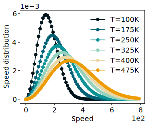
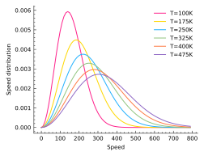

# LovelyPlots
  [](
http://doi.org/10.5281/zenodo.6903937)

> **Warning**
> : As of version 1.0.0, you need to add ``import lovelyplots`` before setting the style (``plt.style.use('ipynb')``).

LovelyPlots is a repository containing ``matplotlib`` style sheets to nicely format figures for scientific papers, thesis and presentations while keeping them fully editable in ``Adobe Illustrator``. Additonaly, ``.svg`` exports options allows figures to automatically adapt their font to your document's font. For example, ``.svg`` figures imported in a ``.tex`` file will automatically be generated with the text font used in your ``.tex`` file.

<p align="center" width="50%">
    
</p>

# Installation

```bash
# to install latest PyPI release
pip install LovelyPlots

# to install latest GitHub commit
pip install --upgrade git+https://github.com/killiansheriff/LovelyPlots.git
```

The pip installation will move all of the ``matplotlib`` style files ``*.mplstyle`` into the appropriate ``matplotlib`` directory.

# Usage

LovelyPlots main style is called ``ipynb``. To use it, add the following lines to the begining of your python scripts:

```python
import lovelyplots
import matplotlib.pyplot as plt
plt.style.use('ipynb')
```

Styles can be combined:

```python
import lovelyplots
import matplotlib.pyplot as plt
plt.style.use(['ipynb','colorsblind34'])
```

In the above case, the ``ipynb`` default color cycle will be overwritten by a 34 colors colorblind safe color cycle called ``colorsblind34``.

If you only wish to apply a style on a specific plot, this can be achieved using:

```python
import lovelyplots
import matplotlib.pyplot as plt

with plt.style.context('ipynb'):
  fig, ax = plt.subplots()
  ax.plot(x, y)
```

# Examples

A few styles are presented here, please see [Styles](#Styles) for a list of all implemented styles. The script used to generate these plots can be found [here](examples/plot.py).

:warning: If you use the ``use_mathtext`` style, ``Adobe Illustrator`` might fail to nicely detect text objects. Please see [here](#Tips-and-Tricks) for work arounds.


The ``['ipynb', 'use_mathtext']`` style:


The ``['ipynb', 'use_mathtext','colors10-markers']`` style:


The ``['ipynb', 'use_mathtext','colors5-light']`` style:


The ``['ipynb', 'use_mathtext', 'colors10-ls']`` style:


The ``['ipynb']`` style:



The ``['paper', 'use_mathtext']`` style:



# Styles

LovelyPlots main style is called ``ipynb``. The latter by default sets the figure size to ``(4.5, 3.46) inches``, uses the default ``matplotlib`` font, activate scientific notation and makes sure your ``matplotlib`` exports will be editable in ``Adobe Illustrator``. Its default color cycle was set to ``colors10``.

## Color cycles

A multitude of color cycles were implemented:

``colors5-light``


``colors5``


``colors10``


``colorsblind10``


``colorsblind34``

Can be seen [here](figs/colors/colorsblind34.png).


## Lines styles, markers and combinations styles

Line styles, markers styles and combinations can be set using the following styles: `ls5`, `marker7`, `colors10-ls`, `colors10-markers`.

## Color maps
Default ``matplotlib`` colormaps were implemented and can be used by adding the following styles: ``cmap-viridis``, ``cmap-inferno``, ``cmap-cividis``, ``cmap-magma``, ``cmap-plasma``.

## Utils

Specific ``matplotlibrc`` parameters can be turned ``on/off`` using the following utilities styles: ``svg_no_fonttype``, ``use_mathtex``, ``use_tex``.

## Fonts

By default the ``ipynb`` style uses the default ``matplotlib`` font. However, one can set its favorite font from a TIFF file:

```python
import lovelyplots as lp
import matplotlib.pyplot as plt

plt.style.use('ipynb')
lp.utils.set_font('my_font.tiff')
```


# Tips and Tricks

## Adobe Illustrator

Unfortunately, ``mathtext`` (and thus nicely formated scientific notation) will mess up ``Adobe illustrator`` ability to detect text objects, and is thus not activated by default. If you wish to use it, please add the style ``use_mathtext``.

## Latex and SVG files
By default, the ``ipynb`` style sets ``svg.fonttype: none``. This allows for plots saved as ``.svg`` not to carry font information. Consequently, when opened in another environement, the plot will be generated with the default system font.

For example, this allows ``.svg`` plots imported inside a ``Latex`` file to directly be generated with the proper document font, without you having to manually edit the fonts to match your document's font. Additonally, you can open the ``.svg`` file as  text file, find the ugly ``1e10`` scientific notation and replace it with ``$10^10$`` so that it is nicely formated when included in your ``.tex`` file.

An example of how to show an svg in a ``.tex`` file:

```tex
\usepackage{svg}

\begin{figure}[htbp]
  \centering
  \includesvg{myfig.svg}
\end{figure}
```
## Retina displays

For those using ``IPython`` notebooks, you can set retina display support by adding the following lines to the begining on your python script:


```python
import lovelyplots as lp
lp.utils.set_retina()
```
## Useth in Google Colab
To use on Google Colab, you will need to run the following code:
```python
!pip install lovelyplots
import lovelyplots
plt.style.reload_library()
plt.style.use('ipynb')
```

# Acknowledgements

This reprository was inspired by [SciencePlots](https://github.com/garrettj403/SciencePlots), but adds different styles and crucial functionalities for useth in ``.tex`` files and ``Adobe Illustrator``.


# Citing 

If you use LovelyPlots, please consider citing: 

    @software{killian_sheriff_2022_6916993,
      author       = {Killian Sheriff},
      title        = {{LovelyPlots, a collection of matplotlib 
                       stylesheets for scientific figures}},
      month        = jul,
      year         = 2022,
      publisher    = {Zenodo},
      version      = {v0.0.26\_LovelyPlots},
      doi          = {10.5281/zenodo.6916993},
      url          = {https://doi.org/10.5281/zenodo.6916993}
    }
